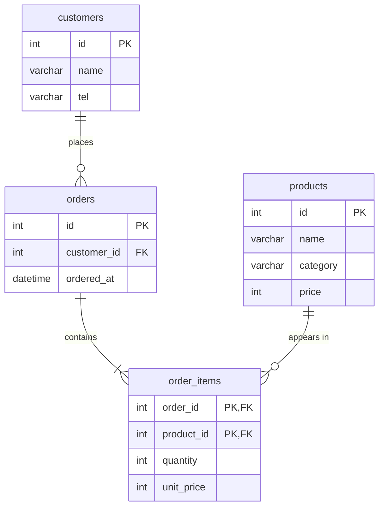

# 쇼핑몰 ERD 설계서

## ERD



## 1. 엔터티 정의

| 엔터티 | 무엇을 담나 | PK |
|---|---|---|
| customers | 회원 기본 정보 (이름, 연락처) | id |
| products | 판매 상품 (이름, 카테고리, 현재 가격) | id |
| orders | 주문 한 건 (누가, 언제) | id |
| order_items | 주문에 담긴 상품 (수량, 주문 시점 가격) | (order_id, product_id) |

## 2. 관계

- customers 1 : N orders — 회원 한 명이 여러 번 주문한다
- orders 1 : N order_items — 주문 하나에 상품이 여러 개 담긴다
- products 1 : N order_items — 상품 하나가 여러 주문에 담긴다
- orders N : M products 관계는 교차 표 order_items로 풀었다

## 3. 정규화 근거

- 각 항목을 "무엇에 딸린 사실인가"로 나눴다. 이름·연락처는 고객, 주문 시각은 주문, 상품명·카테고리·가격은 상품, 수량·주문 시점 가격은 주문과 상품의 조합에 딸린다.
- 고객 정보를 orders에서 분리한 이유: 전화번호가 바뀌면 한 곳만 고치면 되도록 하기 위해서다 (갱신 이상 방지).
- 상품 목록을 한 칸에 쉼표로 담지 않은 이유: 1NF 위반이 되면 상품별 집계·인덱스가 불가능하고 LIKE 검색은 오탐이 생긴다.
- total_price는 두지 않았다. quantity × unit_price로 계산되는 값이라 저장하면 어긋날 수 있다.

## 4. 반정규화 결정

- 결정: order_items.unit_price를 둔다. products.price와 값이 겹치지만 의도된 중복이다.
- 이유: products.price는 지금 가격, unit_price는 주문 시점 가격이다. 상품 가격이 바뀌어도 과거 주문 금액이 소급해서 바뀌면 안 된다.
- 어긋남 방지: 주문 생성 시점에만 기록하고 이후 갱신하지 않는다.

## 5. 확인한 것

- 없는 고객(99번)으로 주문 INSERT → ERROR 1452로 차단됨
- 주문이 있는 고객 DELETE → ERROR 1451로 차단됨
- 기계식 키보드 가격을 89000 → 95000으로 올려도 주문 1의 unit_price는 89000 그대로 유지됨 (확인 후 원복)

## DDL

부모 표(customers, products)부터 만들고 자식 표(orders → order_items) 순서로 만든다. products는 2-1에서 만든 표를 그대로 쓴다.

```sql
CREATE TABLE customers (
    id   INT AUTO_INCREMENT PRIMARY KEY,
    name VARCHAR(50) NOT NULL,
    tel  VARCHAR(20) NOT NULL
);

CREATE TABLE orders (
    id          INT AUTO_INCREMENT PRIMARY KEY,
    customer_id INT NOT NULL,
    ordered_at  DATETIME NOT NULL,
    CONSTRAINT fk_orders_customer
        FOREIGN KEY (customer_id) REFERENCES customers (id)
);

CREATE TABLE order_items (
    order_id   INT NOT NULL,
    product_id INT NOT NULL,
    quantity   INT NOT NULL,
    unit_price INT NOT NULL,  -- 주문 시점 가격 (의도된 반정규화)
    PRIMARY KEY (order_id, product_id),
    CONSTRAINT fk_items_order   FOREIGN KEY (order_id)   REFERENCES orders (id),
    CONSTRAINT fk_items_product FOREIGN KEY (product_id) REFERENCES products (id)
);
```
